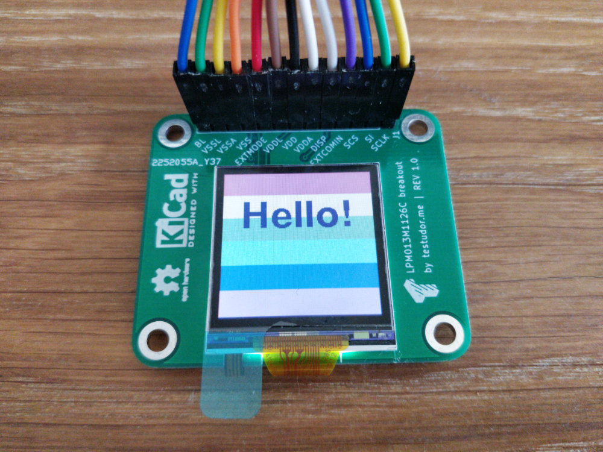

# LPM013M126C breakout

This is a breakout board for the LPM013M126C MIP display from JDI. It makes it easy to use with various dev boards like Arduino, etc.

## Wiring

> **Note** Logic levels as well as supply voltages are 3.3 V. If your use case requires 5 V you'll have to use a level shifter and change the current limiting resistors for the backlight LEDs.

> **Note** Yes, this board has many pins. The display offers the possibility to use separate analog/logic power supplies and I decided to keep this functionality. Same goes for the backlight. For most use cases it's possible to use a common supply for everything.

| PIN      | Description                        | Connect to                     |
| -------- | ---------------------------------- | ------------------------------ |
| SCLK     | Serial Clock Signal                | Connect to MCU SPI Clock       |
| SI       | Serial Data Input Signal           | Connect to MCU SPI MOSI        |
| SCS      | Chip Select Signal                 | Connect to MCU SPI Chip Select |
| EXTCOMIN | COM Inversion Polarity Input       | Not connected                  |
| DISP     | Display ON/OFF Switching Signal    | Connect to any digital pin     |
| VDDA     | Power Supply for Analog            | Connect to +3.3 V              |
| VDD      | Power Supply for Logic             | Connect to +3.3 V              |
| VDDL     | Power Supply for LED               | Connect to +3.3 V              |
| EXTMODE  | COM Inversion Mode Select Terminal | Not connected                  |
| VSS      | Logic Ground                       | Connect to GND                 |
| VSSA     | Analog Ground                      | Connect to GND                 |
| VSSL     | LED Ground                         | Connect to GND                 |
| BL       | LED Backlight Input                | Connect to any digital pin     |

## EXTMODE Jumper

Set EXTMODE to 'L' for use with the library mentioned below

## Software

The display works great with the [JDI_MIP_Display](https://github.com/Gbertaz/JDI_MIP_Display) library! Just make sure to set the right resolution in the config file.

## Further Information

For more information regarding the display please refer to the [official datasheet](https://www.j-display.com/product/pdf/Datasheet/5LPM013M126C_specification_ver03.pdf)!
